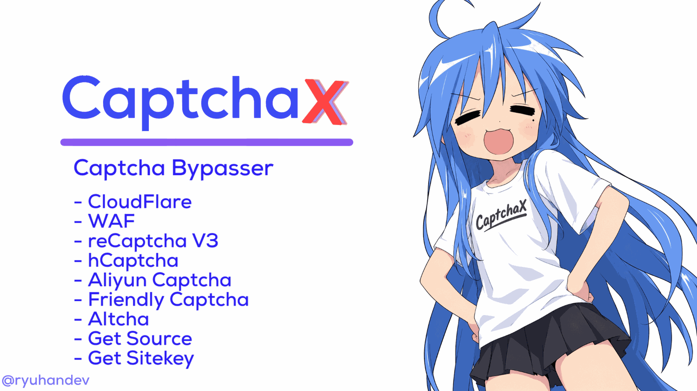

<p align="center">
  
</p>

<h1 align="center">CaptchaX</h1>

<p align="center">
  <strong>All-in-one captcha solver API</strong><br>
  Node.js · Express · Puppeteer · Docker · Railway-ready
</p>

<p align="center">
  <a href="https://github.com/ryuhandev/CaptchaX/stargazers"></a>
  <a href="https://github.com/ryuhandev/CaptchaX/forks"></a>
  <a href="https://github.com/ryuhandev/CaptchaX/issues"></a>
  <a href="https://github.com/ryuhandev/CaptchaX/commits/main"></a>
</p>

<p align="center">
  
  
  <a href="https://github.com/ryuhandev/CaptchaX/blob/main/LICENSE"></a>
  
</p>

<p align="center">
  
  
  
  
</p>

<p align="center">
  
  
  
</p>

<p align="center">
  <a href="https://github.com/ryuhandev"></a>
  
</p>

<p align="center">
  
</p>

---

## Ringkasan

CaptchaX adalah REST API untuk menyelesaikan dan melewati berbagai jenis captcha serta proteksi anti-bot dalam satu layanan: **Cloudflare Turnstile**, **Cloudflare challenge / WAF**, **reCAPTCHA v3**, **hCaptcha**, **Aliyun Captcha 2.0**, **FriendlyCaptcha**, **Altcha (proof-of-work)**, plus utilitas **rendered source** dan **detektor sitekey** otomatis.

Semua solver berjalan di satu proses Express, memakai browser headless (Puppeteer via `puppeteer-real-browser`) hanya pada endpoint yang memang butuh, dan bisa langsung di-deploy ke Railway atau Docker.

<table>
<tr>
<td width="60%" valign="top">

### Kenapa CaptchaX

- Satu endpoint untuk banyak vendor captcha, tidak perlu banyak service terpisah.
- Solver PoW dan token (turnstile, reCAPTCHA v3, altcha, friendly) bersifat **deterministik** dan dijalankan tanpa browser sehingga cepat dan hemat RAM.
- Endpoint berbasis browser memakai page dan profil realistis, termasuk mode "halaman asli" untuk Turnstile yang tertanam di situs target.
- Anti-slop tapi jujur: endpoint `hcaptcha` dan `aliyun` adalah **best-effort**. Kalau tidak bisa, API menjawab `success: false` beserta alasannya, bukan menggantung sampai timeout atau mengarang token palsu.
- Detektor sitekey otomatis memetakan jenis captcha ke endpoint solver yang tepat, jadi alur bisa diotomasi dari URL saja.
- Siap produksi: rate limit per IP, health check, Dockerfile multi-stage, `railway.json`, dan workflow E2E.

</td>
<td width="40%" valign="middle">

<p align="center">
  
</p>

</td>
</tr>
</table>

---

## Daftar Isi

- [Captcha yang Didukung](#captcha-yang-didukung)
- [Tingkat Keandalan Solver](#tingkat-keandalan-solver)
- [Quick Start](#quick-start)
- [Deploy](#deploy)
- [Referensi API](#referensi-api)
- [Deteksi Sitekey Otomatis](#deteksi-sitekey-otomatis)
- [Test Keys](#test-keys)
- [Struktur Proyek](#struktur-proyek)
- [Rate Limit dan Kebutuhan Resource](#rate-limit-dan-kebutuhan-resource)
- [FAQ](#faq)
- [Roadmap](#roadmap)
- [Kontribusi](#kontribusi)
- [Lisensi dan Disclaimer](#lisensi-dan-disclaimer)
- [English Documentation](#english-documentation)

---

## Captcha yang Didukung

| Captcha / Proteksi | Endpoint | Metode | Basis |
|---|---|---|---|
| Cloudflare Turnstile (standalone) | `POST /api/turnstile` | fake page render + optional `action` | Browser |
| Cloudflare Turnstile (embedded) | `POST /api/turnstile-max` | kunjungi URL target, klik widget bila perlu | Browser |
| Cloudflare challenge / WAF | `POST /api/cloudflare` | challenge clicker menuju `cf_clearance` | Browser |
| WAF session | `POST /api/waf-session` | ambil cookies + headers sesi | Browser |
| reCAPTCHA v3 | `POST /api/captchav3` | anchor/reload tanpa browser | HTTP |
| hCaptcha | `POST /api/hcaptcha` | checkbox/invisible | Browser |
| Aliyun Captcha 2.0 | `POST /api/aliyun` | render widget sendiri dari `sceneId` + `prefix` | Browser |
| Aliyun Captcha 2.0 (auto-detect) | `POST /api/aliyun-extract` | deteksi `region` + `prefix` + `sceneId` dari URL | Browser |
| FriendlyCaptcha v1 | `POST /api/friendly` | solver WASM resmi `friendly-pow` | HTTP + WASM |
| Altcha PoW v1 | `POST /api/altcha` | brute force SHA-1/256/384/512 | Komputasi |
| Rendered page source | `POST /api/source` | HTML hasil render browser | Browser |
| Sitekey detector | `POST /api/get-sitekey` | klasifikasi sitekey + rekomendasi solver | Browser |
| Health check | `GET /api/health` | status RAM/CPU/disk | Proses |

---

## Tingkat Keandalan Solver

| Kelompok | Endpoint | Tingkat keandalan | Catatan |
|---|---|---|---|
| PoW / token deterministik | `turnstile`, `turnstile-max`, `captchav3`, `altcha`, `friendly` | Tinggi, hasil dikembalikan saat berhasil | Tidak memakai image challenge. Kalau gagal, penyebabnya jaringan, timeout, atau sitekey salah |
| Sesi browser | `cloudflare`, `waf-session`, `source` | Tinggi selama halaman target merespons normal | Butuh browser dan RAM memadai |
| Best-effort | `hcaptcha`, `aliyun`, `aliyun-extract` | Lolos bila risiko rendah atau tipe cocok | Selalu menjawab `success: false` beserta alasan bila tidak bisa. Tipe icon-click Aliyun tidak didukung |

---

## Quick Start

### Jalankan lokal

```bash
git clone https://github.com/ryuhandev/CaptchaX.git
cd CaptchaX
npm install
cp .env.example .env
npm start
```

Default berjalan di `http://localhost:5000` (ubah lewat `PORT`).

### Verifikasi cepat

```bash
curl http://localhost:5000/
curl http://localhost:5000/api/health
```

### Docker

```bash
docker build -t captchax .
docker run --rm -p 8080:8080 --env-file .env captchax
```

Image sudah memuat Chromium dari apt dan seluruh dependensi sistem yang dibutuhkan solver berbasis browser.

---

### Variabel Environment

| Variabel | Default | Keterangan |
|---|---|---|
| `PORT` | `5000` | Port HTTP. Di Railway, samakan dengan Target Port pada Public Networking |
| `NODE_ENV` | `production` | Mode runtime |
| `MAX_REQUESTS_PER_MINUTE` | `5` | Rate limit per IP untuk seluruh route `/api` |
| `PUPPETEER_EXECUTABLE_PATH` | `/usr/bin/chromium` | Path Chromium di dalam image Docker |

---

## Deploy

### Railway

1. Push repository ke GitHub, lalu buat project baru di Railway dan pilih **Deploy from GitHub repo**.
2. Setiap push ke branch `main` akan memicu **auto-redeploy**.
3. Tambahkan Variables: `PORT=8080`, `NODE_ENV=production`, `MAX_REQUESTS_PER_MINUTE=5`.
4. Pada Public Networking, set Target Port sama dengan nilai `PORT`.
5. Health check memakai `GET /` dan sudah dikonfigurasi di `railway.json`.

### Docker (VPS)

```bash
git clone https://github.com/ryuhandev/CaptchaX.git
cd CaptchaX
cp .env.example .env
docker build -t captchax .
docker run -d --name captchax --restart unless-stopped -p 8080:8080 --env-file .env captchax
```

### E2E Workflow

`.github/workflows/e2e.yml` disediakan untuk uji end-to-end. Workflow ini memakai placeholder URL, jadi isi URL instance kamu sendiri saat menjalankan workflow via `workflow_dispatch`.

<p align="right">
  
</p>

---

## Referensi API

Base URL lokal: `http://localhost:5000`
Base URL produksi: `https://<domain-atau-railway-url-anda>`

Format respons seragam: setiap endpoint mengembalikan objek JSON dengan field `success` (boolean). Bila gagal, disertakan `error` atau `reason` yang menjelaskan penyebabnya.

### `GET /`

Info service, daftar endpoint, dan contoh payload setiap solver.

### `GET /api/health`

Health check berisi statistik RAM, CPU, dan disk.

```bash
curl http://localhost:5000/api/health
```

### `POST /api/turnstile`

Menyelesaikan Turnstile lewat fake page yang dirender sendiri. Field `action` opsional dan diteruskan ke `turnstile.render`.

```json
{
  "sitekey": "0x4AAAAAA...",
  "siteurl": "https://example.com",
  "timeout": 45,
  "action": "login"
}
```

```bash
curl -X POST http://localhost:5000/api/turnstile \
  -H "Content-Type: application/json" \
  -d '{"sitekey":"0x4AAAAAA...","siteurl":"https://example.com","timeout":45,"action":"login"}'
```

Respons:

```json
{ "success": true, "token": "XXXX...", "duration": 12.3 }
```

### `POST /api/turnstile-max`

Menyelesaikan Turnstile yang tertanam di halaman asli. Service mengunjungi URL target dan mengklik widget bila diperlukan.

```json
{
  "url": "https://example.com/page-with-turnstile",
  "timeout": 60
}
```

### `POST /api/captchav3`

reCAPTCHA v3 tanpa browser, memakai jalur anchor/reload.

```json
{
  "sitekey": "6Le-...",
  "siteurl": "https://example.com",
  "timeout": 30
}
```

Respons:

```json
{ "success": true, "token": "...", "duration": 1.2 }
```

### `POST /api/altcha`

Menyelesaikan Altcha proof-of-work v1 (SHA-1/256/384/512). Murni komputasi dan selalu selesai selama challenge valid. Kirim salah satu: `challengeurl` (endpoint JSON yang mengembalikan `{ "challenge", "salt", ... }`) atau objek `challenge` langsung.

```json
{ "challengeurl": "https://example.com/altcha-challenge", "timeout": 60 }
```

```json
{
  "challenge": {
    "algorithm": "SHA-256",
    "challenge": "abc...",
    "salt": "def...&",
    "signature": "...",
    "maxnumber": 1000000
  }
}
```

Respons:

```json
{ "success": true, "payload": "eyJ...", "number": 12345, "algorithm": "SHA-256", "duration": 0.4 }
```

Nilai `payload` berupa base64 dan siap dikirim sebagai field `altcha` ke server tujuan.

### `POST /api/friendly`

Menyelesaikan FriendlyCaptcha v1 proof-of-work memakai solver resmi (`friendly-pow` WASM, algoritma identik dengan widget browser).

```json
{ "sitekey": "FCM...", "timeout": 180 }
```

Tambahkan `puzzleEndpoint` bila situs memakai endpoint kustom. Default global: `https://api.friendlycaptcha.com/api/v1/puzzle`.

Respons:

```json
{
  "success": true,
  "solution": "sig.b64.sol.diag",
  "puzzles": 48,
  "field": "frc-captcha-solution",
  "duration": 50.8
}
```

Isi nilai `solution` ke field `frc-captcha-solution` pada form tujuan.

### `POST /api/hcaptcha`

hCaptcha checkbox atau invisible melalui browser. Bersifat best-effort dan hanya lolos bila tidak muncul image challenge.

```json
{
  "sitekey": "10000000-ffff-ffff-ffff-000000000001",
  "siteurl": "https://example.com",
  "timeout": 60,
  "invisible": false,
  "rqdata": "opsional, untuk enterprise",
  "debug": false
}
```

### `POST /api/aliyun`

Aliyun Captcha 2.0 dengan pendekatan ala CapMonster: widget dirender di halaman minimal milik sendiri bermodal `sceneId` dan `prefix` situs target, tanpa mengunjungi situs target.

```json
{
  "sceneId": "XXXX",
  "prefix": "xxxxxx",
  "region": "sgp",
  "language": "en",
  "mode": "popup",
  "timeout": 120,
  "debug": false
}
```

Cara mendapatkan parameter:

- `prefix` adalah subdomain dari `https://<prefix>.captcha-open.*.aliyuncs.com` pada tab Network.
- `sceneId` diambil dari payload atau body request saat captcha muncul.
- `region` bernilai `sgp` atau `cn`, samakan dengan console situs target. Solver otomatis mencoba region lainnya bila init gagal.

Field opsional: `language` (`en`/`cn`/`tw`), `mode` (`popup`/`embed`/`float`), `sdkUrl` (override CDN SDK), `debug: true` (menyertakan `debug` berisi stages, attempts, dan screenshot saat gagal).

Bila init gagal (`INIT_FAIL`), artinya ketiga parameter tidak cocok atau scene tidak aktif. Solver langsung menjawab jujur tanpa menunggu timeout.

### `POST /api/aliyun-extract`

Mendeteksi otomatis `region`, `prefix`, dan `sceneId` dari URL halaman target. Bersifat best-effort karena captcha biasanya baru dimuat setelah aksi tertentu seperti klik Login, jadi pakai URL yang memang memicu captcha.

```json
{ "url": "https://example.com/login", "timeout": 30 }
```

Respons:

```json
{
  "success": true,
  "region": "sgp",
  "prefix": "xxxxxx",
  "sceneId": "XXXX",
  "sceneIds": [],
  "apiGetLib": "...",
  "requests": [],
  "hint": "ok"
}
```

Tahapan solver saat memecahkan challenge:

- TRACELESS lolos secara otomatis.
- BEHAVIOR-SLIDE melakukan drag penuh menyerupai manusia.
- PUZZLE-SLIDE mendeteksi gap (`shadow.png` vs `back.png`, template matching dengan jimp), lalu drag closed-loop dengan posisi piece dibaca langsung setiap langkah sampai tepat di gap, termasuk retry multi-attempt dengan koreksi.

Respons:

```json
{ "success": true, "verifyParam": "...", "duration": 25.4 }
```

`verifyParam` (captchaVerifyParam) langsung dipakai untuk request bisnis ke server situs target. Token bersifat sekali pakai dan terikat sesi, sehingga verifikasi harus dilakukan dari IP yang sama. Tipe icon-click atau "klik berurutan" tidak didukung dan dijawab `success: false`.

### `POST /api/cloudflare`

Bypass Cloudflare challenge dan mengembalikan `cf_clearance`.

```json
{ "url": "https://example.com", "headless": true, "timeout": 30 }
```

Respons:

```json
{
  "success": true,
  "cf_clearance": "...",
  "cookie_string": "...",
  "cookies": [],
  "user_agent": "..."
}
```

### `POST /api/waf-session`

Mengambil cookies dan headers sesi WAF dari sebuah URL untuk dipakai pada request lanjutan.

```json
{ "url": "https://example.com", "timeout": 60 }
```

Respons:

```json
{ "success": true, "cookies": [], "headers": {}, "duration": 8.1 }
```

### `POST /api/source`

Mengambil HTML hasil render browser, termasuk halaman yang dilindungi proteksi dasar.

```json
{ "url": "https://example.com", "timeout": 60 }
```

Respons:

```json
{ "success": true, "html": "<!DOCTYPE html>...", "duration": 8.1 }
```

### `POST /api/get-sitekey`

Mendeteksi sitekey captcha dari URL target beserta klasifikasinya. Memakai browser untuk memuat halaman, lalu memindai atribut DOM (`data-sitekey` dan sejenisnya), inline script, global variable JS, iframe `src`, serta network request/response.

```json
{ "url": "https://example.com/login", "timeout": 30 }
```

Respons:

```json
{
  "success": true,
  "url": "https://example.com/login",
  "final_url": "https://example.com/login",
  "title": "Login - Example",
  "detected_providers": ["recaptcha", "turnstile"],
  "sitekeys": [
    {
      "type": "recaptcha",
      "label": "Google reCAPTCHA",
      "variant": "v2-or-v3",
      "sitekey": "6Le-wvkSAAAAAPBMRTvw0Q4Muexq9bi0DJwx_mJ-",
      "pattern": "6L-prefixed (Google reCAPTCHA)",
      "sources": ["dom:data-sitekey", "recaptcha-render-param"],
      "solver": "/api/captchav3",
      "solver_param": "sitekey"
    }
  ],
  "aliyun_hint": null,
  "total_keys_found": 1,
  "duration": 7.2
}
```

---

## Deteksi Sitekey Otomatis

Tipe sitekey yang dikenali oleh `/api/get-sitekey`:

| `type` | Label | Pola sitekey | Solver |
|---|---|---|---|
| `turnstile` | Cloudflare Turnstile | diawali `0x` (mis. `0x4AAAAAA...`) | `/api/turnstile` |
| `recaptcha` | Google reCAPTCHA v2 / v3 / enterprise | diawali `6L` | `/api/captchav3` |
| `hcaptcha` | hCaptcha | UUID `xxxxxxxx-xxxx-xxxx-xxxx-xxxxxxxxxxxx` | `/api/hcaptcha` |
| `friendly` | FriendlyCaptcha | diawali `FCM` atau `FCS` | `/api/friendly` |
| `altcha` | Altcha (kandidat) | base64 panjang, tanpa static sitekey | `/api/altcha` dengan `challengeurl` |

Field `solver` dan `solver_param` menunjuk endpoint dan nama parameter yang bisa langsung dipakai, sehingga hasil deteksi dapat diteruskan otomatis ke solver yang sesuai.

Bila Aliyun Captcha terdeteksi, respons menyertakan `aliyun_hint` yang mengarahkan ke `/api/aliyun-extract`, karena Aliyun memakai `sceneId` + `prefix`, bukan sitekey tradisional.

---

## Test Keys

| Solver | Sitekey | Hasil yang diharapkan |
|---|---|---|
| Turnstile | `1x00000000000000000000AA` | `XXXX.DUMMY.TOKEN.XXXX` |
| reCAPTCHA v3 | `6LeIxAcTAAAAAJcZVRqyHh71UMIEGNQ_MXjiZKhI` | token valid |
| FriendlyCaptcha | `FCMGEMUD2M567T8G` (demo homepage) | solusi valid |

<p align="center">
  
</p>

---

## Struktur Proyek

```text
CaptchaX/
├── .github/workflows/e2e.yml     # workflow E2E (URL diisi saat workflow_dispatch)
├── assets/                       # banner dan aset karakter
├── src/
│   ├── index.js                  # Express app, PORT dari env, listen 0.0.0.0
│   ├── routes/
│   │   ├── solve.js              # turnstile, turnstile-max, captchav3, altcha, friendly,
│   │   │                         # hcaptcha, aliyun, aliyun-extract, cloudflare,
│   │   │                         # waf-session, source, get-sitekey
│   │   └── health.js             # /health
│   └── services/
│       ├── turnstile.js          # BypassService: fakePage render + action, max, wafSession, getSource
│       ├── browser.js            # pool puppeteer-real-browser + xvfb
│       ├── captchaV3.js          # reCAPTCHA v3 tanpa browser (anchor/reload)
│       ├── altcha.js             # Altcha PoW v1 (brute force SHA, sesuai altcha-lib)
│       ├── friendly.js           # FriendlyCaptcha PoW v1 (solver WASM resmi)
│       ├── hcaptcha.js           # hCaptcha checkbox/invisible via browser (best-effort, fail-fast)
│       ├── aliyun.js             # Aliyun Captcha 2.0 harvest (closed-loop puzzle drag + jimp gap-detect)
│       ├── extractAliyun.js      # deteksi sceneId/prefix/region Aliyun dari URL target
│       ├── getSitekey.js         # deteksi dan klasifikasi sitekey dari URL target
│       └── cloudflare.js         # challenge clicker menuju cf_clearance
├── Dockerfile
├── railway.json
├── .env.example
└── package.json
```

---

## Rate Limit dan Kebutuhan Resource

- Rate limit default: **5 request per menit per IP**, diubah lewat `MAX_REQUESTS_PER_MINUTE`.
- Endpoint berbasis browser (`turnstile`, `turnstile-max`, `cloudflare`, `waf-session`, `source`, `get-sitekey`, `hcaptcha`, `aliyun`) membutuhkan **RAM minimal 1 GB** karena menjalankan Chromium.
- Endpoint tanpa browser (`captchav3`, `altcha`, `friendly`) ringan dan tetap bisa jalan pada instance kecil.
- Xvfb dikelola otomatis oleh `puppeteer-real-browser`, jadi tidak perlu `xvfb-run` di level container.
- Semua response error memakai HTTP status dan payload JSON yang bisa dibaca mesin.

---

## FAQ

**Apakah semua solver dijamin berhasil?**

Tidak. Endpoint PoW dan token (turnstile, reCAPTCHA v3, altcha, friendly) deterministik, tetapi `hcaptcha` dan `aliyun` bergantung pada profil risiko dan tipe challenge yang muncul. API selalu melaporkan kegagalan secara eksplisit.

**Kenapa `hcaptcha` gagal padahal sitekey benar?**

Umumnya karena muncul image challenge. Solver hanya menangani checkbox dan invisible, dan berhenti lebih awal agar tidak menunggu timeout.

**Berapa lama token valid?**

Token Turnstile, reCAPTCHA, dan hCaptcha berumur pendek dan terikat domain serta sesi. Kirim ke server target segera setelah diterima.

**Bisakah token dipakai dari IP berbeda?**

Tidak disarankan. Untuk Aliyun, verifikasi wajib dari IP yang sama karena token terikat sesi.

**Kenapa endpoint browser sering OOM di Railway?**

Chromium butuh memori. Naikkan plan atau RAM instance, dan hindari memanggil endpoint browser secara paralel dalam jumlah besar.

**Apakah bisa dipakai untuk mengklik urutan gambar Aliyun?**

Belum. Tipe icon-click tidak didukung dan API menjawab `success: false`.

**Apakah ada autentikasi API?**

Belum ada API key bawaan. Lindungi instance dengan proxy, IP allowlist, atau reverse proxy milik sendiri sebelum mengeksposnya ke publik.

---

## Roadmap

- [x] Cloudflare Turnstile (fake page dan embedded page)
- [x] reCAPTCHA v3 tanpa browser
- [x] Altcha PoW (SHA-1/256/384/512)
- [x] FriendlyCaptcha PoW (solver WASM resmi)
- [x] hCaptcha checkbox (best-effort)
- [x] Aliyun Captcha 2.0 + auto-extract `sceneId`/`prefix`
- [x] Cloudflare challenge (`cf_clearance`) dan WAF session
- [x] Rendered page source
- [x] Detektor sitekey otomatis
- [x] Dockerfile, `railway.json`, workflow E2E
- [ ] API key dan kuota per user
- [ ] Antrean job untuk endpoint browser agar lebih stabil di RAM kecil
- [ ] Dukungan webhook / callback hasil solve
- [ ] Image challenge solver untuk hCaptcha
- [ ] Unit test untuk solver PoW tanpa browser

<br>

<p align="left">
  
</p>

---

## Kontribusi

Kontribusi, issue, dan pull request terbuka untuk siapa saja. Alur yang dianjurkan:

1. Fork repository ini dan buat branch baru: `git checkout -b feat/nama-fitur`.
2. Jalankan `npm install` dan uji endpoint yang kamu ubah secara lokal.
3. Pastikan tidak ada kredensial, cookie, atau URL internal yang ikut ter-commit.
4. Buat pull request dengan deskripsi singkat: masalah, pendekatan, dan cara menguji.

Untuk bug report, sertakan endpoint, payload tanpa data sensitif, dan isi respons `error` atau `reason`, serta versi Node dan platform deploy yang dipakai.

---

## Lisensi dan Disclaimer

Dirilis di bawah lisensi **Apache License 2.0**. Lihat berkas [LICENSE](https://github.com/ryuhandev/CaptchaX/blob/main/LICENSE) untuk teks lengkapnya.

Proyek ini disediakan untuk keperluan riset keamanan, pengujian otomatis pada sistem milik sendiri, dan integrasi yang sah. Penggunaan untuk melewati captcha pada layanan pihak ketiga tanpa izin dapat melanggar hukum setempat maupun Terms of Service layanan tersebut. Segala risiko dan konsekuensi penggunaan menjadi tanggung jawab pengguna.

Dibuat dan dirawat oleh [@ryuhandev](https://github.com/ryuhandev).

---

<p align="center">
  <a href="https://star-history.com/#ryuhandev/CaptchaX&Date">
    
  </a>
</p>

<p align="center">
  Kalau proyek ini berguna, beri bintang di repository ini.
</p>

---
---

# English Documentation

<p align="center">
  
</p>

## Overview

CaptchaX is a single REST API that solves and bypasses a broad set of captchas and anti-bot protections: **Cloudflare Turnstile**, **Cloudflare challenge / WAF**, **reCAPTCHA v3**, **hCaptcha**, **Aliyun Captcha 2.0**, **FriendlyCaptcha**, **Altcha proof-of-work**, plus **rendered page source** and an **automatic sitekey detector**.

Everything runs in one Express process. Headless browsers (Puppeteer through `puppeteer-real-browser`) are only used by the endpoints that actually need them, and the service ships ready to deploy on Railway or Docker.

## Endpoint Summary

| Captcha / Protection | Endpoint | Basis |
|---|---|---|
| Cloudflare Turnstile (standalone) | `POST /api/turnstile` | Browser |
| Cloudflare Turnstile (embedded) | `POST /api/turnstile-max` | Browser |
| Cloudflare challenge / WAF | `POST /api/cloudflare` | Browser |
| WAF session cookies and headers | `POST /api/waf-session` | Browser |
| reCAPTCHA v3 | `POST /api/captchav3` | HTTP |
| hCaptcha | `POST /api/hcaptcha` | Browser, best-effort |
| Aliyun Captcha 2.0 | `POST /api/aliyun` | Browser, best-effort |
| Aliyun sceneId/prefix/region extractor | `POST /api/aliyun-extract` | Browser, best-effort |
| FriendlyCaptcha v1 | `POST /api/friendly` | HTTP + WASM |
| Altcha PoW v1 | `POST /api/altcha` | Computation |
| Rendered page source | `POST /api/source` | Browser |
| Sitekey detector | `POST /api/get-sitekey` | Browser |
| Health check | `GET /api/health` | Process |

Reliability groups:

- **Deterministic** (`turnstile`, `turnstile-max`, `captchav3`, `altcha`, `friendly`): no image challenge involved, results are returned as soon as a token or solution is produced.
- **Browser session** (`cloudflare`, `waf-session`, `source`): reliable as long as the target page responds normally.
- **Best-effort** (`hcaptcha`, `aliyun`, `aliyun-extract`): succeed when the risk profile is low or the challenge type matches. Failures are reported explicitly with `success: false` and a reason. Aliyun icon-click challenges are not supported.

## Quick Start

```bash
git clone https://github.com/ryuhandev/CaptchaX.git
cd CaptchaX
npm install
cp .env.example .env
npm start
```

Runs on `http://localhost:5000` by default. Verify with `curl http://localhost:5000/api/health`.

Docker:

```bash
docker build -t captchax .
docker run --rm -p 8080:8080 --env-file .env captchax
```

Environment variables: `PORT` (default `5000`), `NODE_ENV` (default `production`), `MAX_REQUESTS_PER_MINUTE` (default `5`), `PUPPETEER_EXECUTABLE_PATH` (Docker image: `/usr/bin/chromium`).

Railway: create a project from this repository, enable public networking with the target port matching `PORT`, and add the variables above. Pushes to `main` trigger automatic redeploys, and the health check uses `GET /` as configured in `railway.json`.

## Usage Examples

Turnstile, standalone:

```bash
curl -X POST https://your-app.up.railway.app/api/turnstile \
  -H "Content-Type: application/json" \
  -d '{"sitekey":"0x4AAAAAA...","siteurl":"https://example.com","timeout":45,"action":"login"}'
```

```json
{ "success": true, "token": "XXXX...", "duration": 12.3 }
```

Turnstile, embedded on a real page: `{"url":"https://example.com/page-with-turnstile","timeout":60}` posted to `/api/turnstile-max`.

reCAPTCHA v3, no browser: `{"sitekey":"6Le-...","siteurl":"https://example.com","timeout":30}` posted to `/api/captchav3` returns `{ "success": true, "token": "...", "duration": 1.2 }`.

Altcha, either pass a challenge endpoint or the challenge object itself:

```json
{ "challengeurl": "https://example.com/altcha-challenge", "timeout": 60 }
```

```json
{ "challenge": { "algorithm": "SHA-256", "challenge": "abc...", "salt": "def...&", "signature": "...", "maxnumber": 1000000 } }
```

Response: `{ "success": true, "payload": "eyJ...", "number": 12345, "algorithm": "SHA-256", "duration": 0.4 }`. Send the base64 `payload` as the `altcha` form field.

FriendlyCaptcha:

```json
{ "sitekey": "FCM...", "timeout": 180 }
```

Response: `{ "success": true, "solution": "sig.b64.sol.diag", "puzzles": 48, "field": "frc-captcha-solution", "duration": 50.8 }`. Put `solution` into the `frc-captcha-solution` field. Add `puzzleEndpoint` when the site uses a custom endpoint.

hCaptcha: `{"sitekey":"10000000-ffff-ffff-ffff-000000000001","siteurl":"https://example.com","timeout":60}` with optional `invisible` and `rqdata`.

Aliyun Captcha 2.0: `{"sceneId":"XXXX","prefix":"xxxxxx","region":"sgp","timeout":120}` where `prefix` is the subdomain of `https://<prefix>.captcha-open.*.aliyuncs.com` and `sceneId` comes from the captcha request payload. Optional fields are `language` (`en`/`cn`/`tw`), `mode` (`popup`/`embed`/`float`), `sdkUrl`, and `debug`. The response returns `verifyParam`, a one-time session-bound token that must be verified from the same IP.

Cloudflare challenge: `{"url":"https://example.com","headless":true,"timeout":30}` returns `cf_clearance`, `cookie_string`, `cookies`, and `user_agent`.

WAF session: `{"url":"https://example.com","timeout":60}` returns `cookies` and `headers` for follow-up requests.

Rendered source: `{"url":"https://example.com","timeout":60}` returns the rendered `html`.

Sitekey detector: `{"url":"https://example.com/login","timeout":30}` scans DOM attributes, inline scripts, JS globals, iframe sources, and network traffic, then classifies each key as `turnstile` (prefixed `0x`), `recaptcha` (prefixed `6L`), `hcaptcha` (UUID), `friendly` (prefixed `FCM`/`FCS`), or `altcha` (long base64 candidate). Each entry includes the recommended `solver` and `solver_param`. When Aliyun is detected, an `aliyun_hint` points to `/api/aliyun-extract`.

## Test Keys

| Solver | Sitekey | Expected result |
|---|---|---|
| Turnstile | `1x00000000000000000000AA` | `XXXX.DUMMY.TOKEN.XXXX` |
| reCAPTCHA v3 | `6LeIxAcTAAAAAJcZVRqyHh71UMIEGNQ_MXjiZKhI` | valid token |
| FriendlyCaptcha | `FCMGEMUD2M567T8G` | valid solution |

## Operational Notes

- Default rate limit is 5 requests per minute per IP, configurable through `MAX_REQUESTS_PER_MINUTE`.
- Browser endpoints need at least 1 GB of RAM because they run Chromium. Non-browser endpoints stay light on small instances.
- Xvfb is managed internally by `puppeteer-real-browser`, so no external `xvfb-run` wrapper is required.
- Tokens are short-lived and bound to the domain and session that requested them. Forward them immediately, preferably from the same IP.
- There is no built-in API key yet. Put the service behind your own proxy, allowlist, or gateway before exposing it publicly.

## Project Structure

```text
CaptchaX/
├── .github/workflows/e2e.yml     # E2E workflow, fill in your own URL on dispatch
├── assets/                       # banner and character assets
├── src/
│   ├── index.js                  # Express app, PORT from env, listens on 0.0.0.0
│   ├── routes/solve.js           # all solver routes
│   ├── routes/health.js          # GET /api/health
│   └── services/                 # one service per solver, browser pool in browser.js
├── Dockerfile
├── railway.json
├── .env.example
└── package.json
```

## Roadmap

- [x] Turnstile, reCAPTCHA v3, Altcha, FriendlyCaptcha, hCaptcha, Aliyun, Cloudflare, WAF session, source, sitekey detector
- [x] Dockerfile, `railway.json`, E2E workflow
- [ ] API keys and per-user quotas
- [ ] Job queue for browser endpoints to improve stability on small instances
- [ ] Webhook or callback delivery of solve results
- [ ] hCaptcha image challenge solver
- [ ] Unit tests for browser-free PoW solvers

## License and Disclaimer

Released under the **Apache License 2.0**. See [LICENSE](https://github.com/ryuhandev/CaptchaX/blob/main/LICENSE).

This project is provided for security research, automated testing of your own systems, and legitimate integrations. Using it to bypass captchas on third-party services without permission may violate local law and the terms of service of those providers. You are responsible for how you use it.

Maintained by [@ryuhandev](https://github.com/ryuhandev).
